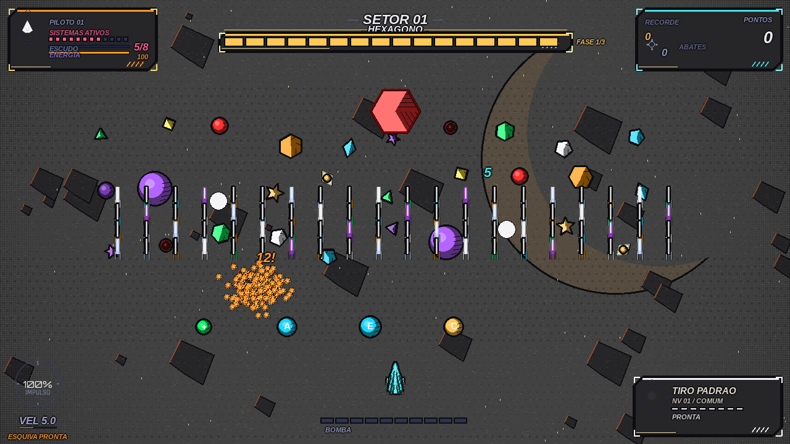
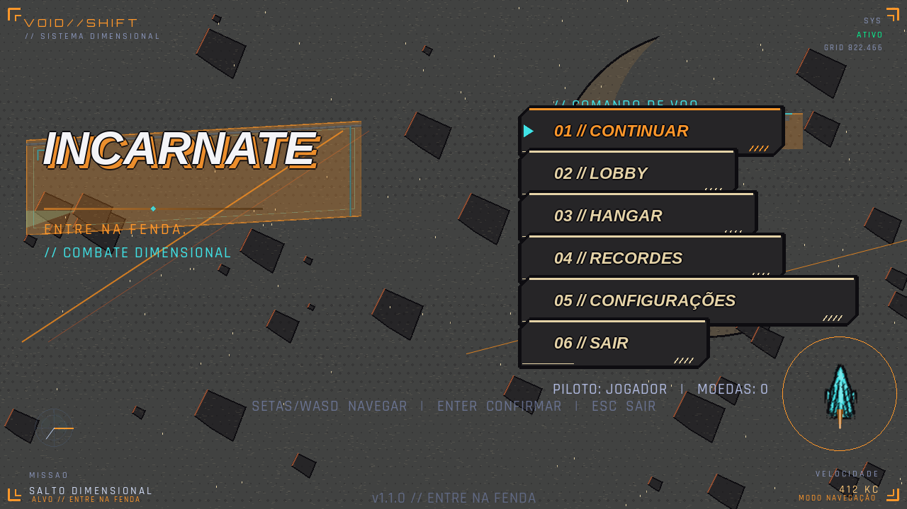

# Visual comic — versão 1.1.0

O jogo usa agora tinta preta, materiais em sombra/base/luz, nave ciano,
cenários espaciais dessaturados, hachuras, papel e retícula impressa. A direção
visual é inspirada em quadrinhos de ficção científica e no contraste de Borderlands;
não inclui personagens, marcas, fontes ou imagens desse jogo.





## Executar, configurar e reverter

```bash
python main.py
```

Em **Configurações → Estilo visual**, escolha **COMIC** ou **ORIGINAL**.
A troca é imediata. As opções são gravadas pelo mecanismo de configurações já
existente; formato de progresso, controles, hitboxes e balanceamento permanecem iguais.
Também é possível definir `"estilo_visual": "ORIGINAL"` no `settings.json` do
usuário. Não altere `data/save.json` para trocar o visual.

**Detalhe comic** controla apenas os novos efeitos:

| Perfil | Contornos e tons chapados | Papel, retícula, hachuras | Tremida |
| --- | --- | --- | --- |
| BAIXA | Sim | Desligados | Desligada |
| MEDIA (padrão) | Sim | Toggles independentes | Desligada |
| ALTA | Sim | Toggles independentes, papel mais denso | Opcional |

`comic_papel`, `comic_halftone` e `comic_hachuras` podem ser desligados
individualmente. `line_boil` começa desligado e só atua em ALTA: alterna duas
impressões do contorno da nave, mantendo a posição do sprite. As preferências
ficam preservadas ao selecionar BAIXA; a tela informa quando estão inativas.
A opção anterior **Qualidade Visual** continua controlando os efeitos antigos e
a política de escala. O benchmark usa EQUILIBRADA nela e MEDIA no detalhe comic.

## Organização e integração

```text
src/infrastructure/graphics/
  comic_theme.py       # paleta, raridade, elementos, fontes, perfis e contexto
  comic_pipeline.py    # posterização, máscara, contornos e banking pré-calculado
  comic_render.py      # primitivas, fundo, papel, retícula, lettering e bursts
src/runtime/
  controllers/render.py             # ativa a estratégia durante a composição
  presentation/damage_feedback.py   # números de dano, somente apresentação
  infrastructure/graphics/          # helpers existentes delegam para comic
  domain/entities/                  # integração somente em métodos de desenho
  domain/world/                     # fundo e partículas via helpers
  presentation/                     # HUD, menu e opções existentes
src/core/settings.py                # valores padrão; mesma persistência
tools/preview_comic.py              # screenshot e benchmark reproduzível
tests/test_comic_visual.py          # contratos e replay de gameplay
```

O código ativo fica em `src/runtime`; `game/` fornece fachadas de compatibilidade.
Antes desta alteração, renderização e entidades compartilhavam métodos
`desenhar()`. `Skin.desenhar()` também emitia partículas e usava o RNG global,
e o contorno da nave alocava superfícies por quadro. O novo estilo usa os
helpers de infraestrutura, preservando as emissões existentes. Texturas novas
usam `random.Random` próprio. O contexto de estilo dura um quadro e é restaurado
mesmo em caso de erro, evitando contaminação entre instâncias e previews.

O controlador de combate somente ganhou notificações visuais após os acertos.
Elas consultam a diferença de vida já aplicada, incluindo absorção, dano em área
e plasma secundário. Nenhum cálculo de dano foi substituído. Números normais são
cor de papel; críticos do tiro padrão são laranja; laser, plasma, íons e nova usam
as cores elementais centralizadas. O modo Original não desenha esses números.

A raridade é uma classificação **visual** por posição no catálogo de armas:
branco, verde, azul, roxo e laranja. Nome e legenda no HUD usam essa classificação;
ela não muda desbloqueios, preços ou atributos.

## Pipeline e caches

1. O loader existente mantém tratamento de arquivo ausente/corrompido e fallback
   procedural. O sprite é escalado antes do processamento pesado.
2. `posterizar()` preserva alpha e nunca modifica a origem. Há quatro níveis por
   canal para assets genéricos; a nave usa três faixas do material ciano.
3. `pygame.mask.from_surface()` calcula uma silhueta por asset/cor. Contornos
   compostos e duas variantes de tinta ficam em cache separado. As 21 inclinações
   da nave são preparadas durante a criação do controlador, fora da animação.
4. Polígonos procedurais mantêm suas formas e recebem faces e hachuras geométricas;
   não há extração de máscaras de polígonos por quadro. Esferas são cacheadas por
   cor, raio inteiro e opção de hachura.
5. Fundo, papel e retícula são preparados por tamanho/setor/perfil no primeiro uso.
   O fundo final exige apenas um blit; não há filtro de pixels sobre a tela por frame.
6. Novas superfícies usam `convert_alpha()` com display inicializado. A fábrica
   aceita preparação sem display usando SRCALPHA como fallback explícito.
7. Caches LRU têm limites. Títulos e nave do menu incluem o estilo na chave para
   que voltar ao Original também restaure sua aparência. Opacidades usam o cache
   já existente, sem `set_alpha()` sobre superfícies compartilhadas.

Polígonos e traços de velocidade são desenhados diretamente por helpers de
infraestrutura; as entidades não implementam novos algoritmos de rasterização.
A UI mantém o sistema de layout e os retângulos de interação existentes.

## Fontes e assets

Nenhuma dependência de runtime foi adicionada. O lettering procura uma fonte
livre opcional em `data/fonts/Comic.ttf`. Sem esse arquivo, usa a fonte local
DejaVu Sans/Liberation Sans/Arial em negrito e itálico, com fallback do pygame.
Não redistribuímos fontes do sistema nem fontes proprietárias de jogos.
A aparência exata da tipografia pode variar entre sistemas.

Os screenshots acima são gerados pelo próprio Pygame. Para regenerar:

```bash
python tools/preview_comic.py --save docs/visual/comic.png
python tools/preview_comic.py --menu --save docs/visual/menu.png
python tools/preview_comic.py --style ORIGINAL --save /tmp/original.png
python tools/preview_comic.py --quality MEDIA --benchmark
```

O utilitário usa SDL dummy por padrão e um diretório temporário de dados.
Ele não escreve no progresso do usuário. Remova a configuração explícita de
`INCARNATE_DATA_DIR` do ambiente se desejar isolamento automático completo.

## Custo medido

Medição local em 2026-09-18: Intel i5-1135G7, Linux, Python 3.14.7,
pygame-ce 2.5.8 / SDL 2.32.10, backend dummy, framebuffer 1280×720,
apresentação escalada a 1920×1080. Dez quadros de aquecimento e 120 amostras.
Cena fixa: 30 inimigos, um boss, 80 projéteis, quatro itens e 180 partículas.

| Operação | Mediana | p95 | Observação |
| --- | ---: | ---: | --- |
| Fundo com papel + halftone | 0,35 ms | 1,04 ms | Um blit; textura já composta |
| Cena com sprites, contornos, hachuras, tiros e efeitos | 3,50 ms | 4,92 ms | Inclui fundo e partículas |
| 180 partículas isoladas | 0,14 ms | 0,16 ms | Bursts em cache |
| HUD e lettering | 1,18 ms | 1,67 ms | Inclui painéis e medidores |
| Escala/apresentação | 4,74 ms | 6,76 ms | 1280×720 → 1920×1080 |
| Quadro completo de renderização | 10,65 ms | 12,50 ms | Inclui apresentação |
| Loop com atualização | 9,89 ms | 11,66 ms | Cena evolui por 120 quadros |

As linhas se sobrepõem e não devem ser somadas. Carregamento total e primeiro
quadro: aproximadamente **666 ms**, incluindo assets antigos, fontes e texturas.
Posterização e máscaras custam zero recomputações por quadro após a preparação.
A tremida troca a variante cacheada; não recalcula máscaras. Hachuras procedurais
custam linhas por face; desligá-las elimina essas linhas. Papel mais denso em ALTA
muda a preparação, mantendo um único blit no desenho.

O modo médio ficou abaixo de **16,67 ms por quadro** nesta medição. SDL dummy não
mede compositor, driver de vídeo ou sincronização com monitor: isso não é uma
garantia universal de 60 FPS. Use **Monitor de FPS** para validar no equipamento
final. O replay com atualização tem carga decrescente, pois os objetos avançam e
expiram; a cena fixa mantém a carga descrita durante toda a amostragem.

## Testes e validação

```bash
python -m pytest tests/test_comic_visual.py -q
python -m pytest tests/ -q
```

Resultado da validação: **369 testes passando** (351 existentes + 18 novos).

A suíte visual cobre:

- Opções inválidas, três qualidades e toggles independentes.
- Três faixas de paleta, quantização e preservação de alpha/origem.
- Reuso de máscara, contorno e variantes de tremida.
- Nenhuma máscara recalculada durante a animação da nave.
- RNG de textura isolado e contexto de renderização restaurado.
- Hitboxes e atributos intactos após desenhar jogador, inimigos, itens e armas.
- Replay dos dois estilos com posições, vida, tiros, pontuação e RNG iguais.
- Dano efetivamente aplicado, cor crítica e ausência de dano fictício.
- Fallback de sprite ausente, troca de estilo e restauração do cache do título.

Também são executados os testes existentes de gameplay, persistência, layout,
HUD, menus, entrada, entidades, cenários e partículas. O lint dos módulos novos
passa; o lint global ainda aponta avisos anteriores em módulos legados.
